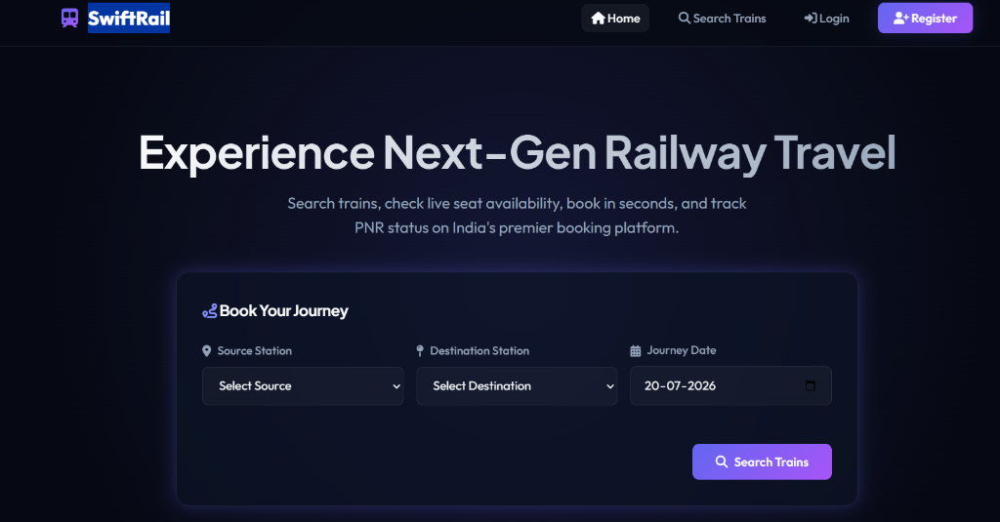
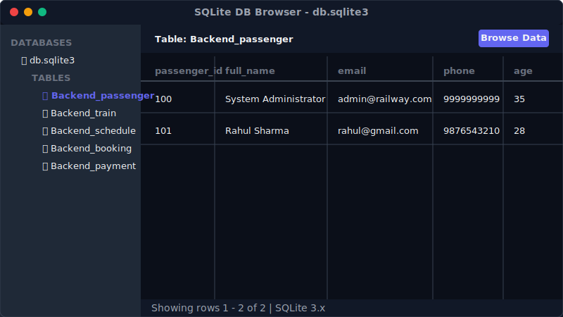
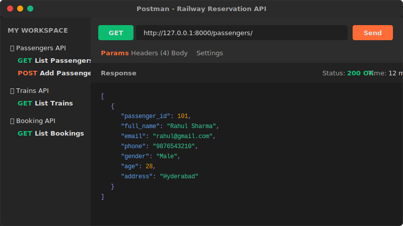

# 🚅 SwiftRail — Railway Reservation System 

SwiftRail is a complete, state-of-the-art **Railway Reservation System** web application. It features a stunning, responsive, glassmorphic dark-theme user interface built with HTML5, CSS3, and Vanilla JavaScript, integrated via the Fetch API with a robust Django REST API backend utilizing SQLite.

---

## 🌟 Application Showcase

### 🖥️ Modern Glassmorphic Homepage


### 📊 SQLite Database Registry (Seeded Data)


### 📡 API Verification in Postman


---

## 🚀 Key Features

*   **👥 Passenger Registration & Login**: Custom credential verification and session token handling.
*   **🔍 Advanced Train Search**: Fast train scheduling inquiries by Source, Destination, and Journey Date.
*   **🎛️ Advanced Search Filters (Bonus)**: Filter schedules by train type (e.g. Rajdhani, Vande Bharat) and departure time slot, and sort results by price, duration, or departure time.
*   **🟢 Live Seat Availability (Bonus)**: Dynamically calculated real-time coach seats remaining based on existing confirmed bookings.
*   **💺 Interactive Visual Seat Selector (Bonus)**: A clickable visual seat layout selector (red for occupied, glass for available, indigo for selected) to reserve specific seats.
*   **💳 Secure Payment Gateway**: Multi-mode payment simulator (UPI, Cards, Net Banking, Wallet) with automatic fare, GST (9% CGST + 9% SGST), and total calculation.
*   **🎫 PNR Status Tracking (Bonus)**: Check live booking status and download reservation ticket PDFs directly using the Booking Reference / PNR ID.
*   **📉 Passenger Analytics Dashboard (Bonus)**:
    *   Trip metrics (Total Bookings, Upcoming Journeys, Cancelled Tickets, Total Spent).
    *   Interactive **Chart.js** graphs (Spending trends over time and coach preference distribution).
    *   Recent transaction logs.
*   **📁 Journey History & Cancellation**: View past and upcoming itineraries with instant cancel capabilities.
*   **📄 Ticket PDF Generation (Bonus)**: Generate and download reservation slips as PDFs using client-side **html2pdf.js**.
*   **⚙️ Admin Dashboard**: Master administrative operations panel allowing full CRUD (Add, View, Edit, Delete) on Passengers, Train Fleet, Schedules, Bookings, and Payments.

---

## 📂 Project Directory Structure

```
RailwayReservationSystem/
├── manage.py
├── db.sqlite3
├── Backend/
│     ├── __init__.py
│     ├── settings.py
│     ├── db.py (Models & DB Schema)
│     ├── models.py (Re-exports db.py)
│     ├── serializers.py
│     ├── views.py (Function-Based Views / REST APIs)
│     └── urls.py
└── Frontend/
      ├── index.html
      ├── login.html
      ├── register.html
      ├── trains.html
      ├── train_details.html
      ├── booking.html
      ├── payment.html
      ├── booking_history.html
      ├── passenger_dashboard.html
      ├── admin_dashboard.html
      ├── style.css
      └── script.js
```

---

## 📡 REST API Reference

### 🧑 Passenger Management
*   `POST /passengers/add/` — Register a new passenger profile.
*   `GET /passengers/` — Retrieve the list of all registered passengers.
*   `PUT /passengers/update/<id>/` — Update passenger profile fields.
*   `DELETE /passengers/delete/<id>/` — Remove passenger account.
*   `POST /passengers/login/` — Authenticate credentials and establish session.

### 🚅 Train Fleet Management
*   `POST /trains/add/` — Add a new train to the fleet.
*   `GET /trains/` — Retrieve all train records.
*   `PUT /trains/update/<id>/` — Edit train features (type, capacity, route).
*   `DELETE /trains/delete/<id>/` — Remove train from the registry.

### 📅 Route & Schedule Management
*   `POST /schedules/add/` — Create a new routing schedule.
*   `GET /schedules/` — Query schedules (supports source, destination, and date filters).
*   `PUT /schedules/update/<id>/` — Edit schedule dates, timings, or base fare.
*   `DELETE /schedules/delete/<id>/` — Cancel schedule.

### 🎫 Ticket Reservation Management
*   `POST /bookings/add/` — Initiate ticket booking (Status: Pending).
*   `GET /bookings/` — List all reservation logs.
*   `PUT /bookings/update/<id>/` — Update seat assignment or set status (Confirmed/Cancelled).
*   `DELETE /bookings/delete/<id>/` — Erase reservation record.

### 💳 Payment & Finance Management
*   `POST /payments/add/` — Log transaction payment record.
*   `GET /payments/` — Retrieve all payment records.
*   `PUT /payments/update/<id>/` — Modify transaction status.
*   `DELETE /payments/delete/<id>/` — Erase transaction history.

---

## 🛠️ Installation & Execution

### 1. Pre-requisites
Ensure Python 3.8+ is installed on your local computer.

### 2. Install Packages
Run the following command to install Django and required extensions:
```bash
pip install django djangorestframework django-cors-headers
```

### 3. Initialize & Start Backend Server
From the root project directory (`RailwayReservationSystem/`), execute the commands:
```bash
python manage.py makemigrations Backend
python manage.py migrate
python manage.py runserver
```
*Note: On its very first execution, the Django server **automatically seeds** the SQLite database with testing profiles (Rahul Sharma, Vande Bharat schedules, etc.) so that you can test immediately!*

### 4. Run Frontend Client
Simply double-click or open `Frontend/index.html` in any web browser. The frontend is fully connected to the Django REST API backend on `http://127.0.0.1:8000`.

---

## 🧪 Testing Credentials

-   **Passenger Portal**:
    *   **Email**: `rahul@gmail.com`
    *   **Password**: `rahul123`
-   **Admin Control Center**:
    *   **Email**: `admin@railway.com`
    *   **Password**: `admin123`
